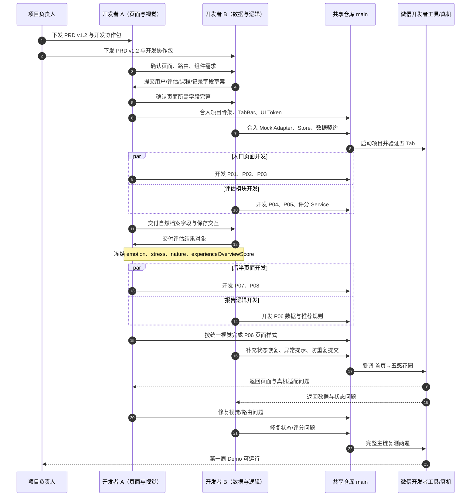
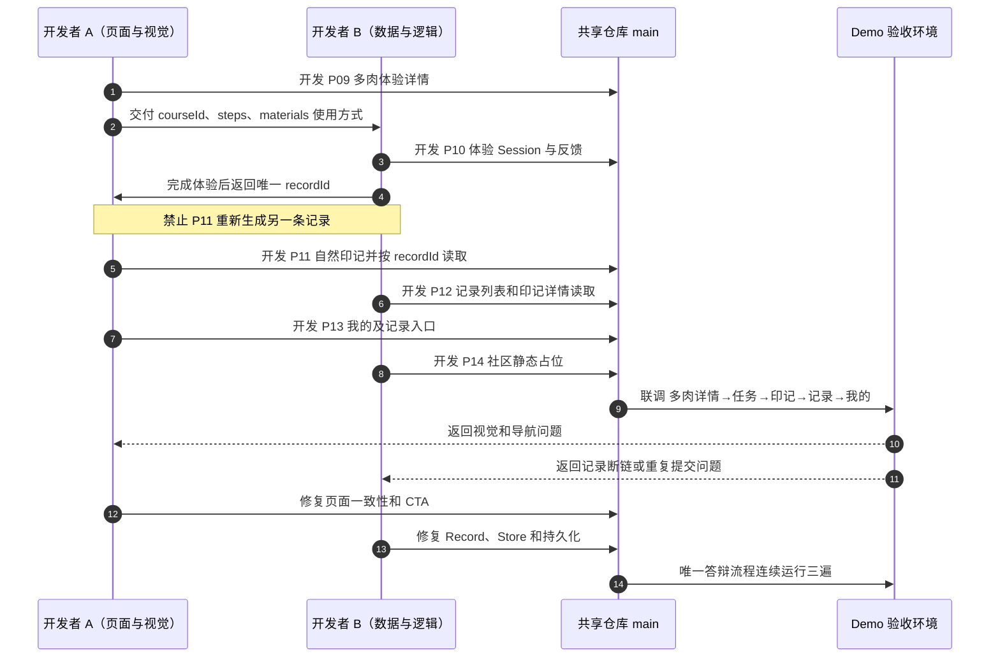
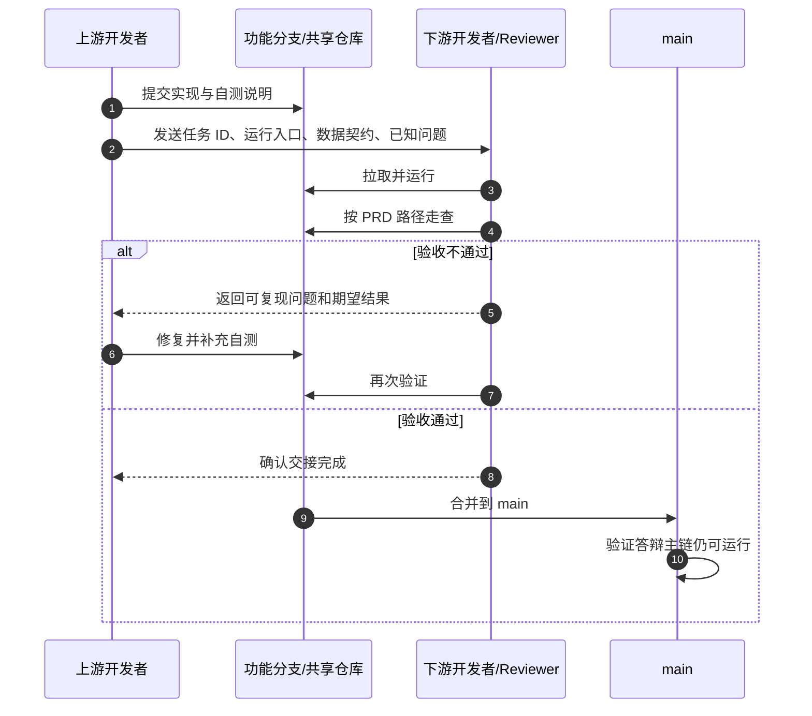

# 两人合作开发任务交互时序图

> 本图描述开发者 A、开发者 B 在两人协作中的任务交付、数据契约冻结、页面联调和验收顺序。它不是产品用户流程图。

## 1. 第一周协作时序



## 2. 第二阶段核心闭环时序



## 3. 单个任务交接时序



## 4. 每日同步模板

两位开发者每日结束前各自提供：

```text
今日完成：
- 任务 ID：
- 页面/模块：

可验证路径：
- 从哪里进入：
- 操作步骤：
- 预期结果：

交付给对方：
- 组件/API/字段：
- 是否已冻结：

当前阻塞：
- 问题：
- 是否影响答辩主链：是/否

明日计划：
- 任务 ID：
```

## 5. 冲突处理顺序

发生文档、页面或排期冲突时，按以下顺序裁决：

```text
产品边界
↓
页面定义
↓
开发计划
```

- 产品定义以 PRD v1.2 中的 `01 产品需求规格说明书` 为准。
- 页面实现以 `03 页面开发手册` 为准。
- 开发顺序以 `06 开发计划与任务拆分` 和本协作包为准。
- 任何冲突都不能通过增加后台、社区或复杂登录解决。

